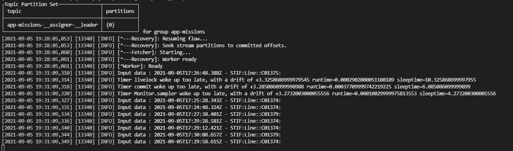
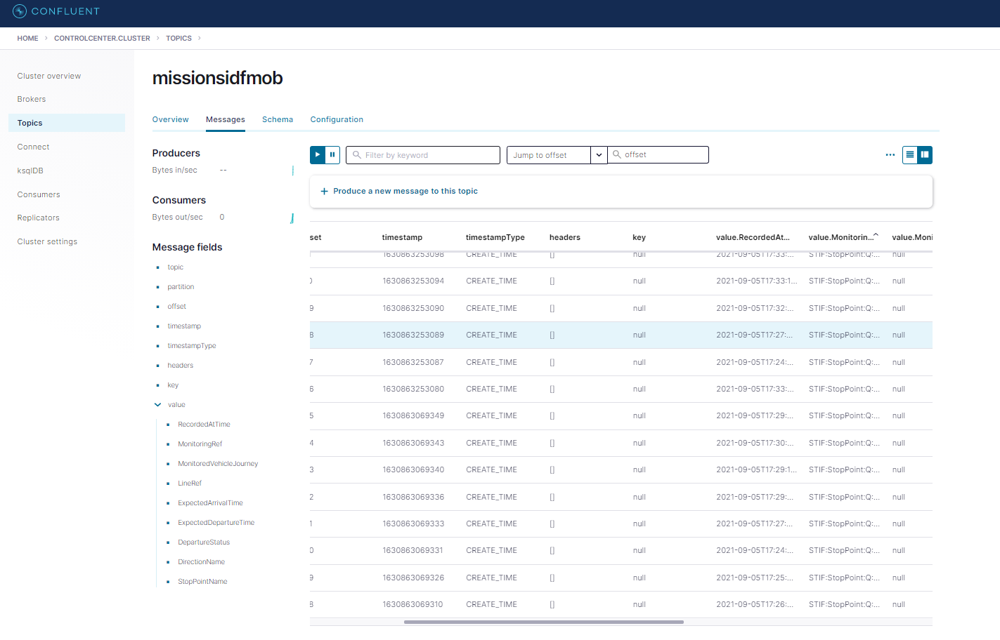

## Présentation de Kafka

Apache Kafka est une plateforme distribuée de streaming de données. Il est essentiellement utilisé comme un broker de messages (bus de messages). On peut le voir comme un intermédiaire entre les applications générant des données et les applications consommant des données. Il est architecturé pour supporter la scalabilité horizontale. Un des points forts de Kafka est sa faible latence, de l'ordre de la milliseconde, pour traiter un message. Le traitement se fait en continu : dès sa réception, le traitement du message peut être exécuté.

Quelques concepts Kafka :

* Un topic est la façon de catégoriser ou de regrouper les messages. Il faut le voir comme un rangement spécial dans le bus pour un type de message donné.
* Un producer est tout système qui publie dans un topic Kafka.
* Un consumer est tout système qui lit des messages dans les topics Kafka.


## Exemple d'application

### Streaming des données Iles de France mobilité

L'exemple d'application consiste à récupérer les prochains passages à un arrêt des tramways, métros, RER ou trains en Ile-de-France.

Pour plus d'informations sur le fonctionnement l'API Ile de France Mobilités, vous pouvez consulter la
[documentation](https://portal.api.iledefrance-mobilites.fr/images/com_apiportal/doc/IDFM-portailAPI-documentation.pdf)

### Organisation du code

* **data** : contient un fichier contenant la liste des arrêts (Métro, tramway, RER, ...)
* **src** : contient le code permet de récupérer les données depuis et les stocker dans Kafka
* **src/config** : contient un fichier yaml contenant les informations pour se connecter à l'API l'île de France Mobilités
* **notebooks** : contient un notebook pour réaliser les travaux sur Kafka
* **docker-compose.yaml** : fichier yaml pour créer les services

### Installation de kafka

Pour installer Kafka avec Docker, vous pouvez placer dans le dossier contenant le fichier `docker-compose.yaml` et lancez la commande:
```bash
docker-compose up -d
```

L'interface de contrôle est accessible [ici](http://localhost:9021)

Pour plus d'informations, vous pouvez visiter le site de la [plateforme Confluent](https://docs.confluent.io/platform/current/quickstart/ce-docker-quickstart.html).

Un tutoriel de prise en main Kafka est disponible [ici](notebooks/tutoriel-kafka.ipynb). Il permet de :
* Connecter à Kafka
* Créer ou supprimer un topic
* Créer un producer et un consumer

Lancement du script de récupération des données en temps réel :
* Le script est dans src/app.py
* Renseigner dans le script le nom d'arrêt (Ex: `Les Halles`) et le type d'arrêt (`Station de métro`)
* Utiliser cette commande pour lancer l’application :
```bash
faust -A app worker -l info
```


Depuis l'interface de contrôle, vous pouvez vérifier les données sont bien stockées dans le topic Kafka.



**Sources:**    
[Apache Kafka 101](https://blog.octo.com/apache-kafka-101/)     
[Spark Streaming et Kafka Streams : un rapide tour d’horizon](https://bigdatablog.skapane.com/spark-streaming-et-kafka-streams-un-rapide-tour-dhorizon/)
